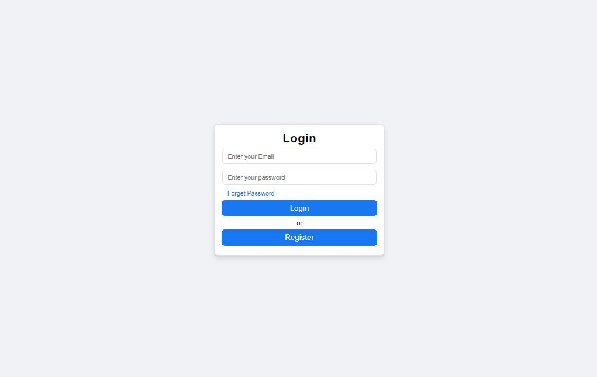
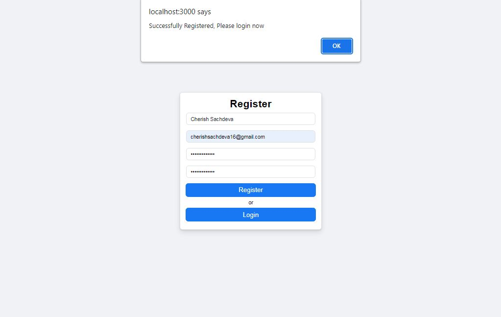
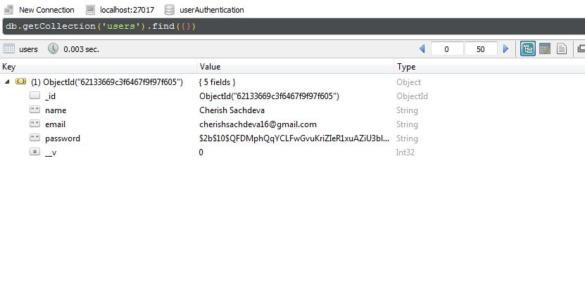
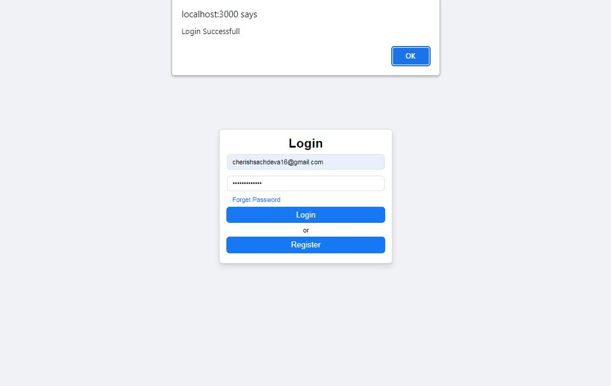
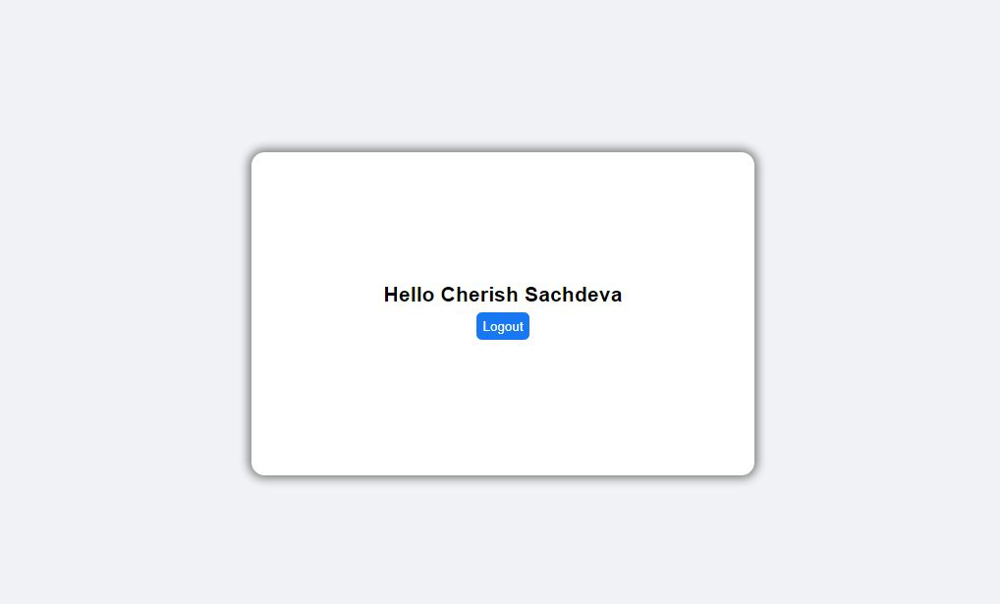
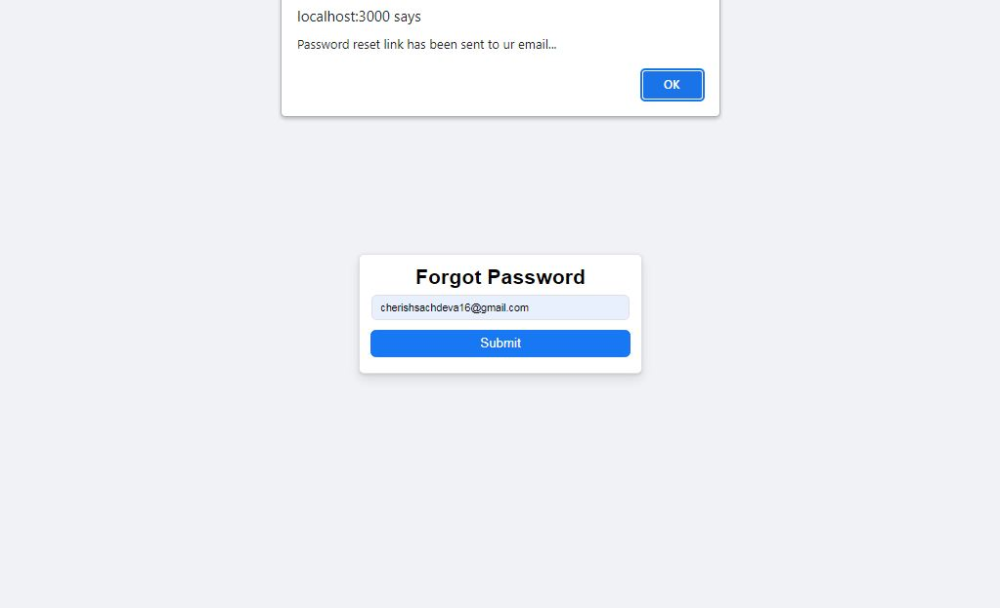
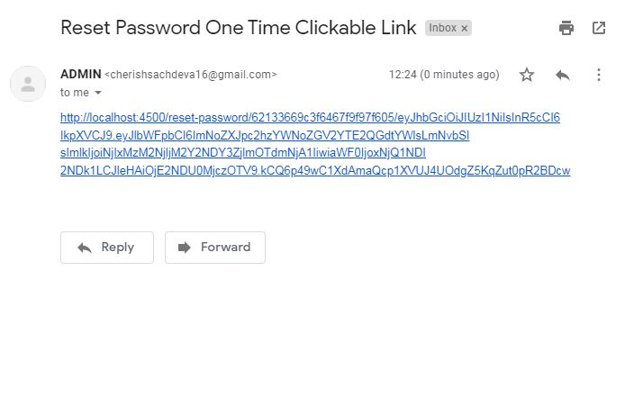
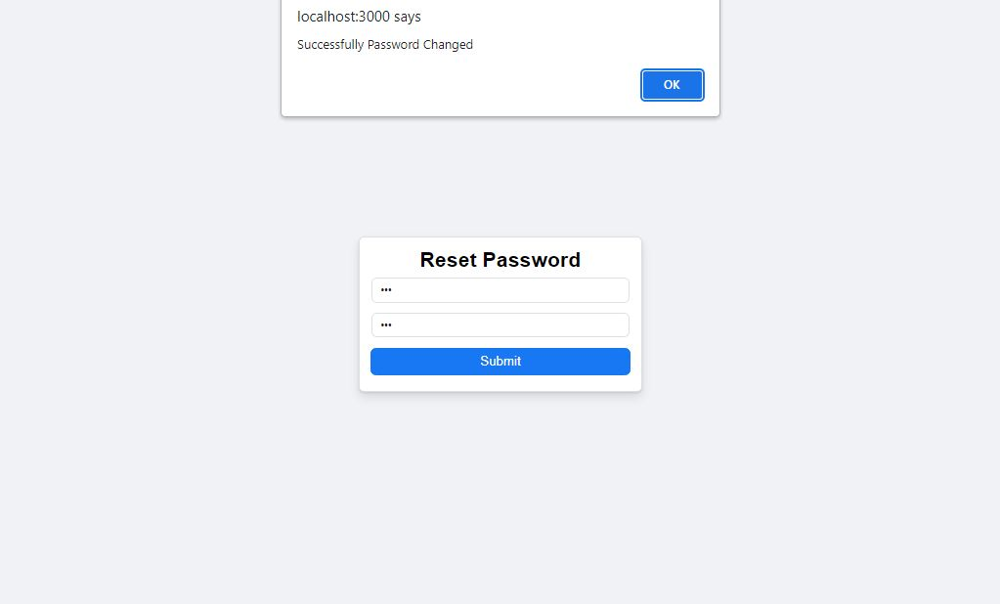

<h1 align="center">CODING ASSIGNMENT</h1>
<h2 align="center">User Authentication</h2>
<h3 align="center">Tech-Stack: ReactJS, NodeJS, ExpressJS, MongoDB</h3>

## 🧐 FLOW OF PROJECT

1) User goes to http://localhost:3000/ and clicks on Register


2) Fills the required credentials and the data gets stored in database with hashed password.



3) Again go to http://localhost:3000/ and Login by filling the required credentials.


4) If your filled data matches with the credentials in database. You will be redirected to homepage.


5) If you forget your password, then click on Forget Password at http://localhost:3000/. You will be redirected to http://localhost:3000/forgot-password where you should
enter your email address.


6) Reset password link will be mailed at your email address.


7) Click on it to be redirected to reset-password page. Enter your new password and submit it.



## 🏁 Getting Started (to run project locally)

Follow the steps below, after cloning the repository:

### 🖐 Requirements

**For Installing:**

- Node

### ⏳ Installation

- Navigate into the server folder and use npm to install the server-side dependencies

```bash
cd server
npm install
```

This command installs all the server-side dependencies needed for the game to run locally.

- Use npm to run server

```bash
npm start
```

This command gets the server running on localhost port 4500.

- In a separate terminal, navigate into the client folder and use npm to install the client-side dependencies

```bash
cd client
npm install
```

This command installs all the client-side dependencies needed for the game to run locally.

- Finally, use npm to run client

```bash
npm start
```

This command gets the client running on localhost port 3000.

Head over to http://localhost:3000/ to start using it! 🎉
